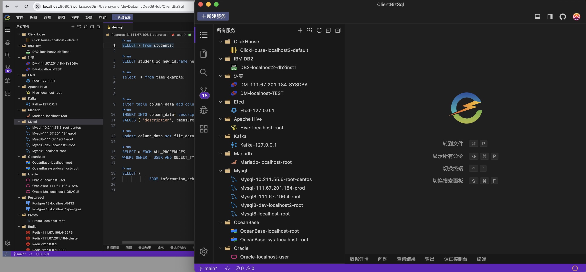
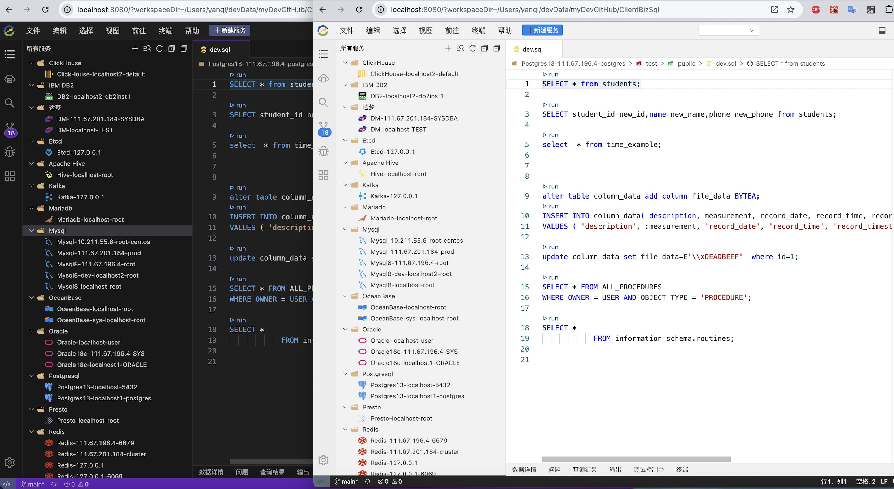
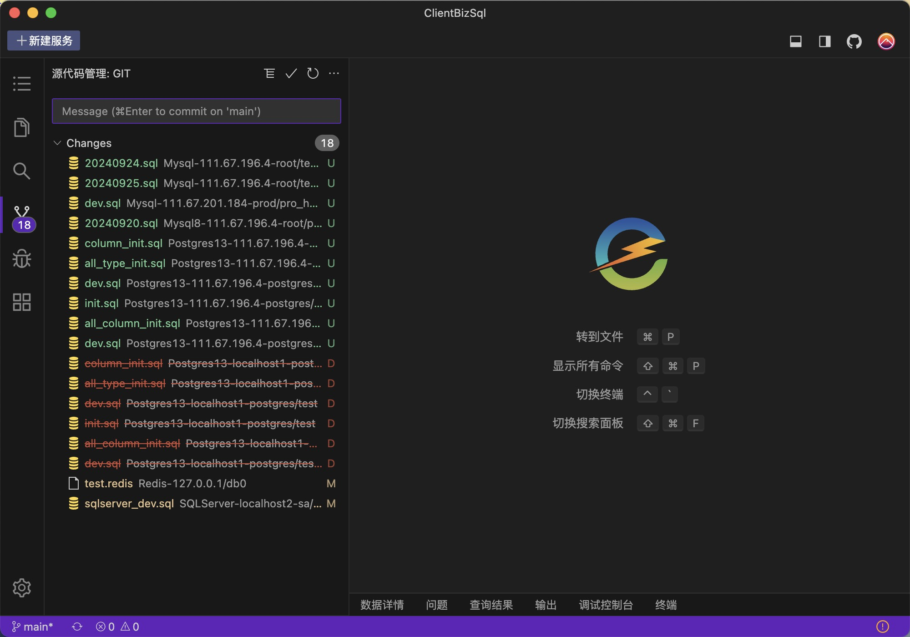
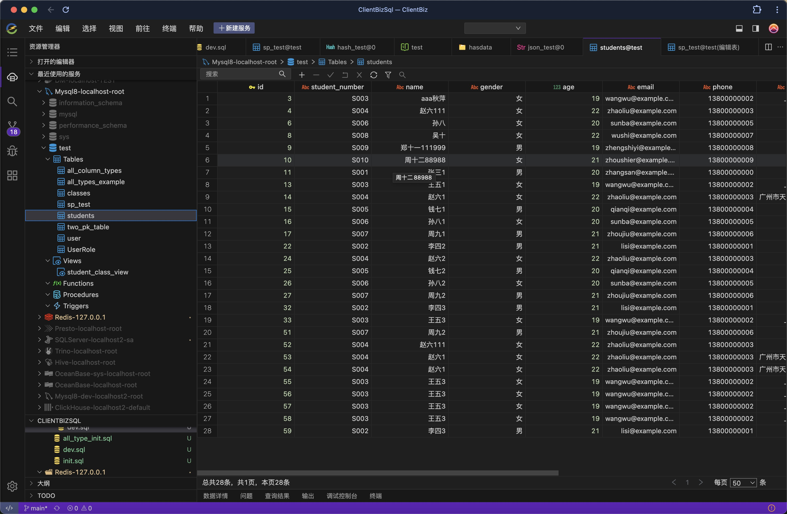
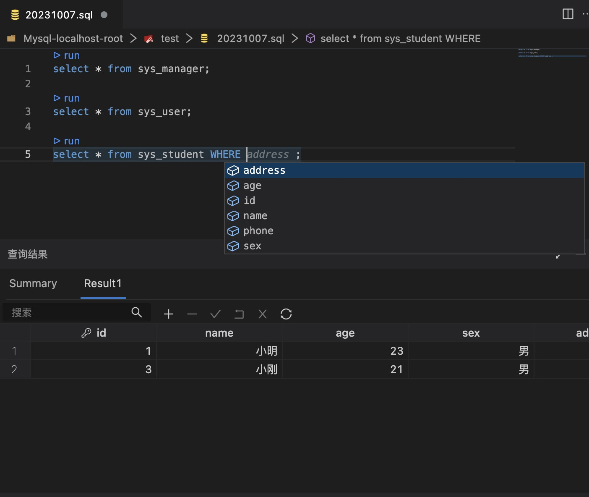
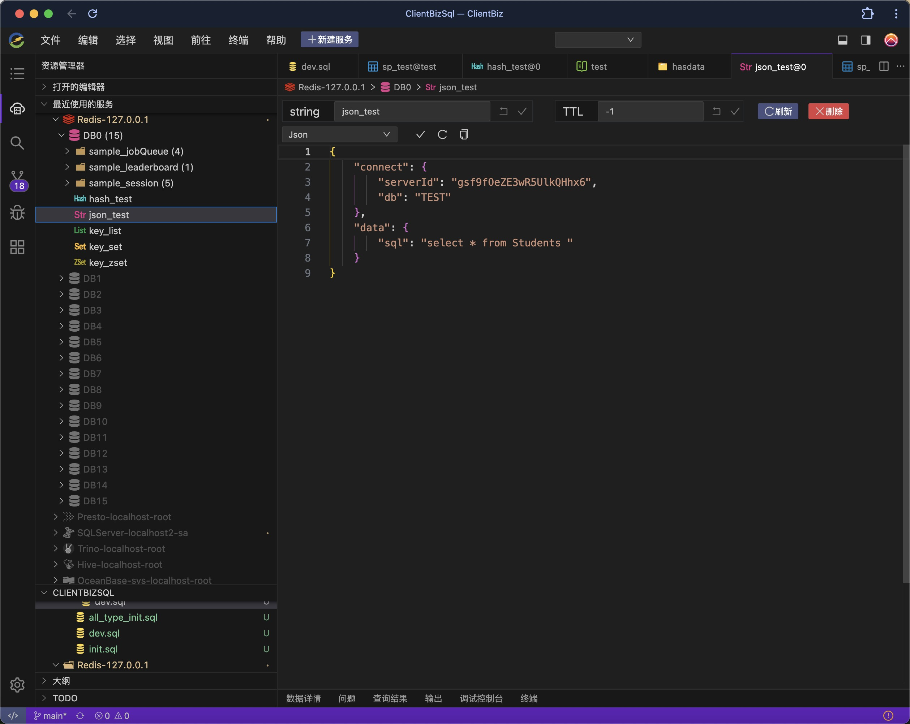
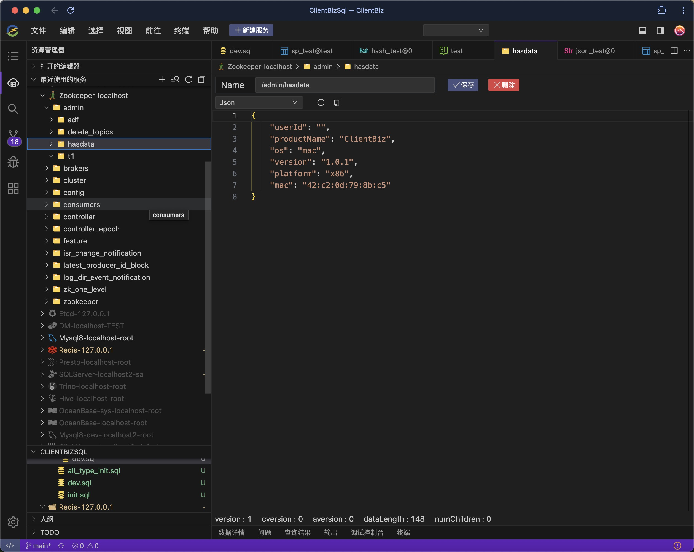
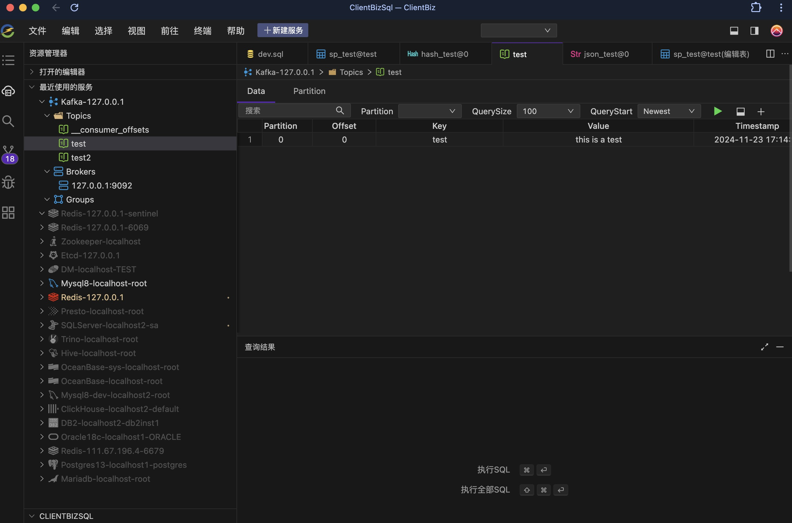
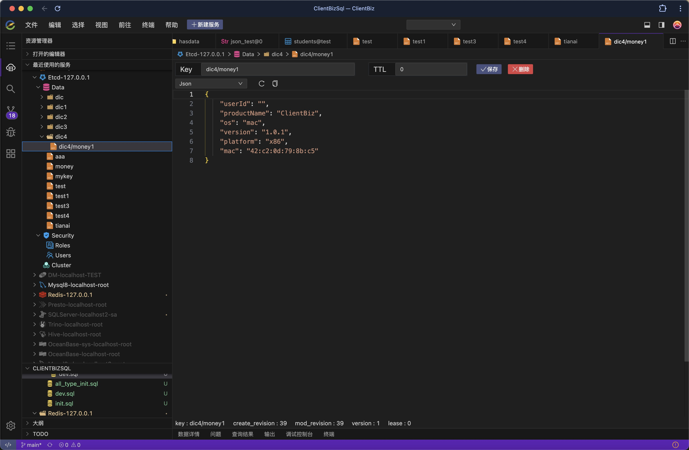

<p align="center">
	<a href="https://www.clientbiz.cn"></a>
</p>
<h1 align="center">AnyClient IDE </h1>

<div align="center">

如果觉得 AnyClient 对您有帮助的话，请帮忙在
<a target="_blank" href='https://gitee.com/hanbingzi/anyclient-ide'>gitee</a>或
<a target="_blank" href='https://github.com/hanbingzi/anyclient-ide'>github</a>
平台上面的右上角点个⭐ Star ，您的支持是 AnyClient 开源的最大的动力
</div>

[官网地址](https://www.clientbiz.cn)

[AnyClient Web 版本请移步此处（源码地址）](https://github.com/hanbingzi/anyclient-web)


[GitHub主页地址](https://github.com/hanbingzi)


[Gitee主页地址](https://gitee.com/hanbingzi)

AnyClient是一款开源的，支持WEB、Dokcer、客户端版本，能够连接各种类型的关系数据库、非关系型数据库、时序数据库、图数据库、消息队列、注册中心等数据服务的管理软件，支持Mac和Windows平台安装部署。


<h2 align="center">AnyClient当前支持的客户端 </h2>

|                        -                        |                       -                        |                        -                         |                     -                      |                       -                        |                   -                    |
|:-----------------------------------------------:|:----------------------------------------------:|:------------------------------------------------:|:------------------------------------------:|:----------------------------------------------:|:--------------------------------------:|
|           |   |          |  |      |  |
|                      Mysql                      |                   Postgresql                   |                      Oracle                      |                  Mariadb                   |                   SqlServer                    |                 Redis                  |
|   |          |                  |        |  |      |
|                    Zookeeper                    |                     Kafka                      |                        达梦                        |                    TiDB                    |                   oceanbase                    |                  DB2                   |
|             |    |  |    |          |                                        |
|                      Etcd                       |                    TDEngine                    |                    ClickHouse                    |                   Presto                   |                     Trino                      |                                        |

<h2 align="center">AnyClient下一步将要支持的客户端 </h2>

|                        -                         |                      -                       |                     -                      |                   -                    |                  -                  |                    -                     |
|:------------------------------------------------:|:--------------------------------------------:|:------------------------------------------:|:--------------------------------------:|:-----------------------------------:|:----------------------------------------:|
|  |  |  |   |  |  |
|                  Elasticsearch                   |                   Influxdb                   |                  MongoDB                   |                  Emq                   |                人大金仓                 |                  Sqlite                  |
|          |      |                                        |                                     ||
|                     Hive                     |                   Neo4j                    |                                        |                                     | |                                          |

## 一：功能特点

- **开源免费**
- **安装包、WEB、Docker方式安装使用**
- **丰富的表数据编辑，表结构修改编辑、SQL编辑器，执行SQL查询和脚本等**
- **方便的Git管理SQL及其他语言脚本**
- **丰富的第三方客户端支持**
- **优秀的智能脚本语言提示**
- **基于OpenSumi二次魔改，支持VSCODE插件**


## 二：AnyClient功能截图

### 安装包、WEB、Docker方式安装使用

### 多种主题切换

### 使用GIT管理脚本



## 三：AnyClient客户端功能
### 1.数据库支持功能
包括：Mysql，Oracle，Postgresql，Mariadb，SqlServer，达梦，TiDB，OceanBase，DB2，ClickHouse，Presto，Trino，TDEngine
```bash
├── 数据库  
│   └── 右键
│       ├── 新建库
│       ├── 删除库
│       ├── 刷新
│       └── 关闭连接              
├── 表   
│   ├── 右键
│   │   ├── 重命名
│   │   ├── 编辑表结构
│   │   ├── 清空表数据
│   │   ├── 删除表
│   │   ├── 复制表创建SQL
│   │   └── 复制表查询语句
│   ├── 表查询
│   │   ├── 条件查询
│   │   ├── 翻页
│   │   ├── 删除一条或多条
│   │   ├── 修改一条或多条
│   │   └── 选中一行右键
│   │       ├── 删除记录
│   │       ├── 上方插入行
│   │       ├── 下方插入行
│   │       ├── 复制行
│   │       ├── 粘贴行
│   │       ├── 复制为insert语句
│   │       ├── 复制为update语句
│   │       └── 复制为delete语句
│   ├── 表新建
│   │   ├── 字段名称
│   │   ├── 字段类型
│   │   ├── 字段长度
│   │   ├── 字段精度
│   │   ├── 字段是否为空
│   │   ├── 字段默认值
│   │   ├── 字段主键
│   │   └── 字段注释
│   │  
│   └── 表编辑
│       ├── 修改字段名称
│       ├── 修改字段类型
│       ├── 修改字段长度
│       ├── 修改字段精度
│       ├── 修改字段是否为空
│       ├── 修改字段默认值
│       ├── 修改字段主键
│       └── 修改字段注释                  
├── 视图
│   ├── 查询
│   ├── 删除
│   └── 复制创建sql
├── 函数
│   ├── 查询详情
│   ├── 删除
│   └── 查看创建sql
├── 存储过程
│   ├── 查询详情
│   ├── 删除
│   └── 查看创建sql
└── 触发器
    ├── 查询详情
    ├── 删除
    └── 查看创建sql
```
#### Mysql数据查询

#### sql 智能补充


### 2.Redis支持功能

```bash
├── 展示
│   ├── 库
│   ├── key
│       ├── string
│       │   ├── Text 
│       │   ├── Json
│       │   ├── Hex
│       │   ├── Binary
│       │   ├── MsgPack
│       │   ├── Java Serialized
│       │   ├── Java Serialized
│       │   └── Java Serialized
│       ├── hash
│       ├── set
│       ├── zset
│       └── list                  
├── 数据编辑
│       ├── string
│       │   ├── Text 
│       │   ├── Json
│       │   ├── Hex
│       │   ├── Binary
│       │   ├── MsgPack
│       │   ├── Java Serialized
│       │   ├── Java Serialized
│       │   └── Java Serialized
│       ├── hash（新增、删除、修改）
│       ├── set（新增、删除、修改）
│       ├── zset（新增、删除、修改）
│       └── list （新增、删除、修改）                    

```

#### Redis操作主界面


### 3.Zookeeper支持功能

1. 新增key
2. 删除key
3. 修改key

#### Zookeeper操作主界面


### 4.Kafka支持功能
1. 消息
   - 查询消息
   - 新增消息
2. topic
   - 新建topic
3. Broker查看
4. Group查看

#### Kafka操作主界面 



### 5.Etcd支持功能
1. Data
  - 查询
  - 修改
  - 删除
  - 新增
2. Security
  - 用户
    - 新增
    - 删除
  - 角色
    - 新增
    - 删除
3. Cluster查询


#### Etcd操作主界面


## 四：运行代码

```bash
$ git clone https://github.com/hanbingzi/anyclient-ide.git
$ cd anyclient-ide
$ yarn
$ yarn build
$ yarn rebuild-native --force-rebuild=true
$ yarn start
```


## 捐献作者

开源创作不易，请多支持
<div>
  
  
</div>

## 商务联系

作者邮箱：hanbingzi@aliyun.com

加我微信
<div>
  
</div>

## 最后


## License

GPL-3.0
